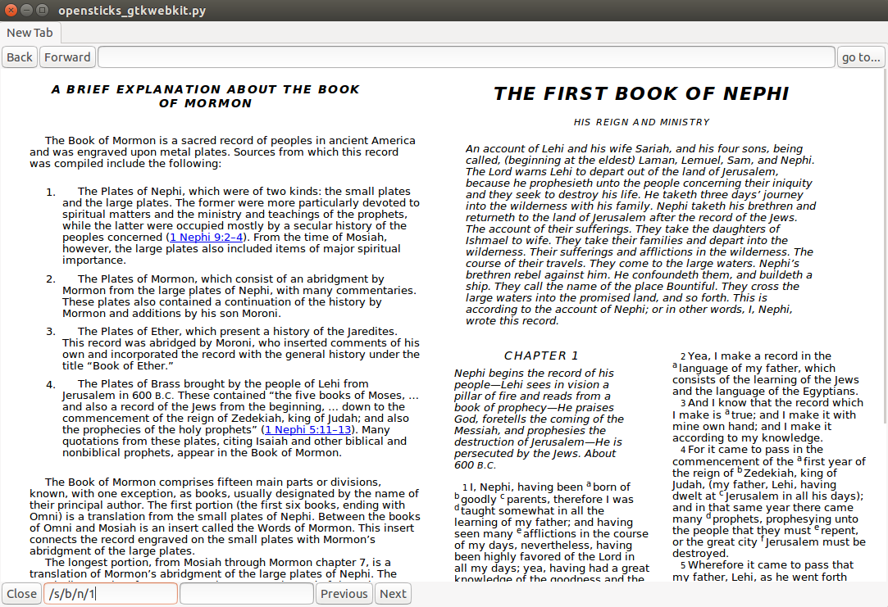

OpenSticks
==========

Scriptures in two column per page, left/right pages, with the same page breaks as the standard works print edition.  This is inspired by the knowledge that spatial indicators assist in memory recall.  The common "scroll" format loses an important spatial indicator.  This is a trivial matter if reading a novel, but with books which will be studied for a lifetime, page breaks are needed which are consistent with the printed version.  The object is to provide more spatial indicators, rather than less, to facilitate learning, searching, and retention.

Usage: 
------

                              
* Use getdata.py to download the scripture databases in Catalog.sqlite.

    *  TEMPORARY ISSUE:  Sometime between 2016 and 2017, the database format has changed.  Instead of returning an html unicode string, pointer is returned.  Currently, a copy of the database 2016 or earlier will need to be used.  I do not know if this can be obtained from lds.org.  For debugging the problem with the new database format, use the following:
    *  Prior to running getdata.py:

        1. Get Catalog version number: 
           http://broadcast3.lds.org/crowdsource/mobile/gospelstudy/production/2.0.3/index.json
        2. Get catalog zip file
           http://broadcast3.lds.org/crowdsource/mobile/gospelstudy/production/2.0.3/catalogs/<CATALOG_VERSION>.zip
        3. Unzip the file.  The file "Catalog.sqlite" should result
        4. More detailed instructions at:  http://blog.crosswaterbridge.com/how-the-gospel-library-content-system-works/

* Use convertbom.py to create a modified Book of Mormon database file.  This reads bomconv.txt, which contains instructions on how to modify the database.  This is only the first few chapters of the book.  It's work to update, so I'm looking for feedback on the html methodology before continuing.
* Run opensticks_gtkwebkit.py

Ctrl-S highlights the search bar in lower left corner.  Type /s/b/n/2 to see 1 Nephi 2.  Ctrl-n = nextpage.  Ctrl-p = previous page.  Type /s/b/n/2/s to see an indented version of the source, which is quite valuable in debugging errors in bomconv.txt and convertbom.py.

The file opensticks_gtkwebkit.py is a minimally modified version of  `pybrowser.py <https://gist.github.com/kklimonda/890640>`_ which calls readsticks.py.  It is intended to easily be replaced by any other gui program.

FAQ
---

1. **What's in the name "OpenSticks"?**  Sticks is a reference to scrolls, as described in Ezekiel 37:16-20.  Members of the Church of Jesus Christ of latter-day Saints generally regard the "stick of Judah" to be the Bible and the "stick of Joseph" to be the Book of Mormon, having been written by descendants of Ephraim.  The two are now published in a single volume, becoming "one in thine hand", marking the beginning of a gathering (verses 21 and 22).

2. **Why not "OpenScriptures"?**  There is already a project called OpenScriptures.

3. **What modifications are made to the database?**  The modified database adds 
's as described in pagelayout.pdf.  The database should still be readable by existing programs, such as Gospel Library, as they will simply ignore the extra column break div's.  The one place this will break down is when a verse is split across a column break.  In the original database, each verse is a paragraph.  It is necessary to end the paragraph in the middle of the verse at the end of a column, then start a new paragraph at the beginning of the next column.  Currently, the new paragraph does not have an id.  The annotation system may not know how to deal with this.  In OpenSticks, this new paragraph will probably need to be given an id before annotations can reliably be added.

4. **Why not modify the database and distribute the modified version?**  I don't know if this would be a copyright violation ... probably.  Hopefully, the Church will one day distribute a version with 
 tags marking column start and end, or grant permission to distribute a modified database here.  

..   don't need this   raw:: html
   <object data="pagelayout.pdf" type="application/pdf" width="700px" height="700px">
    <embed src="pagelayout.pdf">
            
 --->>> embedded view of pagelayout.pdf ... This browser does not support PDFs. Please download the PDF to view it. 

    </embed>
   </object>

Prerequisites:
--------------

Python 2.7  

from gi.repository import Gtk, Gdk, WebKit  

import requests 

import sqlite3 

import sys 

import os 

from zipfile import ZipFile 

import shlex 

from zipfile import ZipFile 

from bs4 import BeautifulSoup 

import re  

Tested on linux. 

Licensing:   
----------

getdata.py:  See embedded text in file ...   

convertbom.py:  CreativeCommons ...   

readsticks.py:  CreativeCommons ...   

opensticks_gtkwebkit.py  (Unknown.  See `pybrowser.py <https://gist.github.com/kklimonda/890640>`_.  This is not critical since this is the gui wrapper likely to be completely replaced if used on a platform other than linux.)   

Road map:
---------

* Images to illustrate book gutter, column partitions, and page edges.
* Complete database conversion routines.
* Replace opensticks_gtkwebkit.py with a Kivy browser in Android.
* Date stamp for highlighting, and selectable dates for showing highlights (a lifetime of highlights).
* Addition of large notes to the database with added footnotes at the bottom of the page or as links, and/or margin placed javascript sticky notes.
* Additional spatial indicators can be imagined, for example:

  * Edge of page markers which change size depending on how far along in the book you are, to simulate the feel of "half way through."  Book tabs.
  * Flipping page turning.   
  * User defined outline markers which may add a character, or optionally show the text in scroll format with indentation and outline headings.
  * Showing the entire book of Isaiah in tiny print, one chapter per column, showing where user specific markings are and/or user specified outline indicators.    
  * Integration with a timeline app (to create your own timeline for personal study).

    * Javascript which could work on mobile devices:  https://timeline.knightlab.com/docs/instantiate-a-timeline.html
    * Desktop python which works best as a stand alone app:  https://www.maketecheasier.com/python-timeline-creator-linux/

  * Margin symbols to identify topics.  (Temple, family, love, obedience, etc.)

Credits: 
--------

Methods in the following were valuable in getting over the initial hurdle of downloading and reading the database files.  Future integration is possible for the search capability.
`CrossWaterBridge/python-gospel-library <https://github.com/CrossWaterBridge/python-gospel-library>`_

